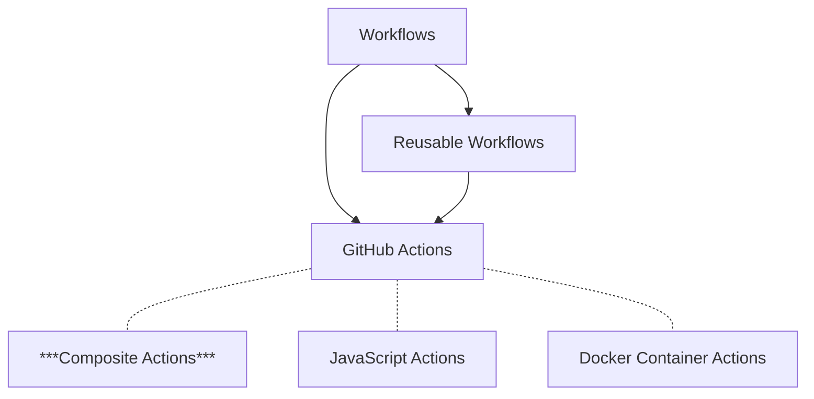

# DevantlerTech GitHub Actions - Composite Actions 🚀

> [!NOTE]
> To see DevantlerTech's Reusable Workflows, please visit the [devantler-tech/reusable-workflows](https://github.com/devantler-tech/reusable-workflows) repository.

Welcome to the DevantlerTech GitHub Actions repository! This repository contains [composite actions](#composite-actions) designed to streamline your CI/CD processes.  These actions are used across all DevantlerTech projects, ensuring consistency and efficiency.

The below diagram illustrates the relationship between GitHub Workflows and GitHub Actions.

## Composite Actions

[Composite actions](https://docs.github.com/en/actions/tutorials/creating-a-composite-action) are a powerful way to group multiple steps into a single action. They allow composing small, reusable components that can be used in any GitHub Actions context, e.g, within reusable workflows, standalone workflows, other composite actions, or even in other GitHub Actions.

- **[Auto Merge Action](auto-merge-action/README.md)** - Composite action to approve and auto-merge PRs from specific bots/users
- **[Cleanup GHCR Action](cleanup-ghcr-action/README.md)** - Clean up old GitHub Container Registry (GHCR) packages
- **[Dockerfile Lint Action](dockerfile-lint-action/README.md)** - Lint Dockerfiles using Hadolint
- **[.NET Test Action](dotnet-test-action/README.md)** - Test .NET solution or project
- **[Flux GitOps Deploy Action](flux-gitops-deploy-action/README.md)** - Push manifests to OCI and deploy using Flux
- **[Install Cilium Action](install-cilium-action/README.md)** - Installs Cilium using Helm in a Kubernetes cluster
- **[Install Flux Action](install-flux-action/README.md)** - Installs Flux in a Kubernetes cluster using the Flux CLI
- **[Setup KSail Action](setup-ksail-action/README.md)** - Installs KSail CLI via Homebrew
- **[Sync Labels Action](sync-labels-action/README.md)** - Sync GitHub labels
- **[TODOs Action](todos-action/README.md)** - A composite action to create GitHub issues from TODO comments
- **[Zizmor Action](zizmor-action/README.md)** - Run security analysis of GitHub Actions on your repository using zizmor 🌈
