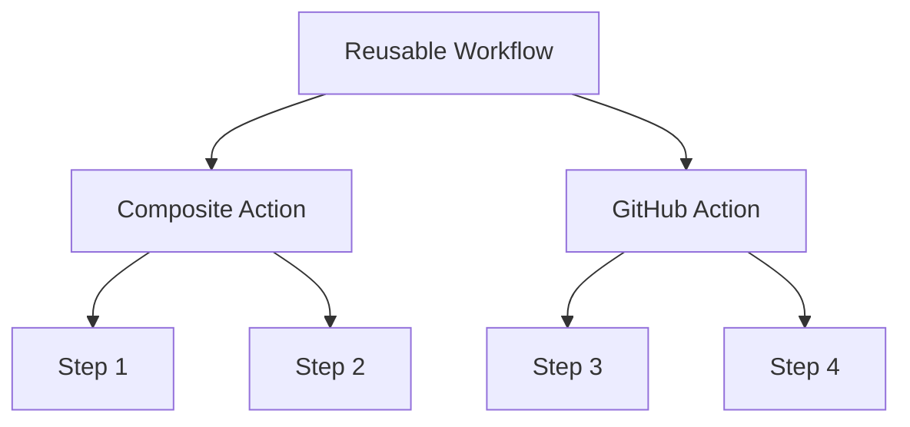

# DevantlerTech GitHub Actions 🚀

Welcome to the DevantlerTech GitHub Actions repository! This repository contains reusable workflows and composite actions designed to streamline your CI/CD processes. I (@devantler) use these actions across all my personal projects, ensuring consistency and efficiency.

The below diagram illustrates the relationship between reusable workflows, composite actions, and other GitHub Actions.



## Table of Contents <!-- omit in toc -->

- [Reusable Workflows](#reusable-workflows)
  - [CD - Cluster Bootstrap](#cd---cluster-bootstrap)
  - [CD - .NET Application Publish](#cd---net-application-publish)
  - [CD - .NET Library Publish](#cd---net-library-publish)
  - [CD - GitOps Deploy](#cd---gitops-deploy)
  - [CI - Auto Merge](#ci---auto-merge)
  - [CI - .NET Test](#ci---net-test)
  - [CI - GitOps Test](#ci---gitops-test)
  - [CI - GitOps Validate](#ci---gitops-validate)
  - [Release](#release)
  - [TODOs](#todos)
  - [Zizmor](#zizmor)
- [Composite Actions](#composite-actions)

## Reusable Workflows

[Reusable workflows](https://docs.github.com/en/actions/how-tos/sharing-automations/reuse-workflows#creating-a-reusable-workflow) are designed to encapsulate common CI/CD patterns that can be shared across multiple repositories. They allow you to define a workflow once and reuse it in the job-scope of other workflows. This reduces duplication and enables building generic workflows for common tasks.

### CD - Cluster Bootstrap

[.github/workflows/reusable-workflow-cd-cluster-bootstrap.yaml](.github/workflows/reusable-workflow-cd-cluster-bootstrap.yaml) is a workflow used to bootstrap a cluster on the DevantlerTech platform. It installs core components like Cilium and Flux.

#### Usage

To use this reusable workflow, you can include it in your workflow file as follows:

```yaml
jobs:
  bootstrap-cluster:
    uses: devantler-tech/github-actions/.github/workflows/reusable-workflow-cd-cluster-bootstrap.yaml@{ref} # ref
    secrets:
      KUBE_CONFIG: ${{ secrets.KUBE_CONFIG }}
      SOPS_AGE_KEY: ${{ secrets.SOPS_AGE_KEY }}
    with:
      DEPLOYMENT_ENV: dev
```

#### Secrets and Inputs

| Key              | Type           | Default | Required | Description            |
| ---------------- | -------------- | ------- | -------- | ---------------------- |
| `KUBE_CONFIG`    | Secret         | -       | ✅        | Kubernetes config file |
| `SOPS_AGE_KEY`   | Secret         | -       | ✅        | Age key for SOPS       |
| `DEPLOYMENT_ENV` | Input (string) | `dev`   | ✅        | Deployment environment |

### CD - .NET Application Publish

[.github/workflows/reusable-workflow-cd-dotnet-application-publish.yaml](.github/workflows/reusable-workflow-cd-dotnet-application-publish.yaml) is a workflow used to publish .NET applications.

#### Usage

```yaml
jobs:
  publish-application:
    uses: devantler-tech/github-actions/.github/workflows/reusable-workflow-cd-dotnet-application-publish.yaml@{ref} # ref
    secrets:
      NUGET_API_KEY: ${{ secrets.NUGET_API_KEY }}
```

#### Secrets and Inputs

| Key             | Type   | Default | Required | Description   |
| --------------- | ------ | ------- | -------- | ------------- |
| `NUGET_API_KEY` | Secret | -       | ✅        | NuGet API key |

### CD - .NET Library Publish

[.github/workflows/reusable-workflow-cd-dotnet-library-publish.yaml](.github/workflows/reusable-workflow-cd-dotnet-library-publish.yaml) is a workflow used to publish .NET libraries to NuGet and GHCR.

#### Usage

```yaml
jobs:
  publish-library:
    uses: devantler-tech/github-actions/.github/workflows/reusable-workflow-cd-dotnet-library-publish.yaml@{ref} # ref
    secrets:
      NUGET_API_KEY: ${{ secrets.NUGET_API_KEY }}
```

#### Secrets and Inputs

| Key             | Type   | Default | Required | Description   |
| --------------- | ------ | ------- | -------- | ------------- |
| `NUGET_API_KEY` | Secret | -       | ✅        | NuGet API key |

### CD - GitOps Deploy

[.github/workflows/reusable-workflow-cd-gitops-deploy.yaml](.github/workflows/reusable-workflow-cd-gitops-deploy.yaml) is a workflow used to deploy applications using GitOps with Flux.

#### Usage

```yaml
jobs:
  gitops-deploy:
    uses: devantler-tech/github-actions/.github/workflows/reusable-workflow-cd-gitops-deploy.yaml@{ref} # ref
    secrets:
      KUBE_CONFIG: ${{ secrets.KUBE_CONFIG }}
      SOPS_AGE_KEY: ${{ secrets.SOPS_AGE_KEY }}
    with:
      DEPLOYMENT_ENV: dev
```

#### Secrets and Inputs

| Key              | Type           | Default | Required | Description            |
| ---------------- | -------------- | ------- | -------- | ---------------------- |
| `KUBE_CONFIG`    | Secret         | -       | ✅        | Kubernetes config file |
| `SOPS_AGE_KEY`   | Secret         | -       | ✅        | Age key for SOPS       |
| `DEPLOYMENT_ENV` | Input (string) | `dev`   | ✅        | Deployment environment |

### CI - Auto Merge

[.github/workflows/reusable-workflow-ci-auto-merge.yaml](.github/workflows/reusable-workflow-ci-auto-merge.yaml) is a workflow that automatically merges pull requests from trusted bots and maintainers.

#### Usage

```yaml
jobs:
  auto-merge:
    uses: devantler-tech/github-actions/.github/workflows/reusable-workflow-ci-auto-merge.yaml@{ref} # ref
```

### CI - .NET Test

[.github/workflows/reusable-workflow-ci-dotnet-test.yaml](.github/workflows/reusable-workflow-ci-dotnet-test.yaml) is a workflow used to test .NET solutions or projects across multiple operating systems.

#### Usage

```yaml
jobs:
  dotnet-test:
    uses: devantler-tech/github-actions/.github/workflows/reusable-workflow-ci-dotnet-test.yaml@{ref} # ref
    secrets:
      CODECOV_TOKEN: ${{ secrets.CODECOV_TOKEN }}
```

#### Secrets and Inputs

| Key             | Type   | Default | Required | Description   |
| --------------- | ------ | ------- | -------- | ------------- |
| `CODECOV_TOKEN` | Secret | -       | ✅        | Codecov token |

### CI - GitOps Test

[.github/workflows/reusable-workflow-ci-gitops-test.yaml](.github/workflows/reusable-workflow-ci-gitops-test.yaml) is a workflow used to test GitOps configurations with Flux.

#### Usage

```yaml
jobs:
  gitops-test:
    uses: devantler-tech/github-actions/.github/workflows/reusable-workflow-ci-gitops-test.yaml@{ref} # ref
    secrets:
      KSAIL_SOPS_KEY: ${{ secrets.KSAIL_SOPS_KEY }}
    with:
      HOSTS_FILE: hosts
      ROOT_CA_CERT_FILE: root-ca.crt
```

#### Secrets and Inputs

| Key                 | Type           | Default | Required | Description                      |
| ------------------- | -------------- | ------- | -------- | -------------------------------- |
| `KSAIL_SOPS_KEY`    | Secret         | -       | ❌        | SOPS Age key for KSail           |
| `HOSTS_FILE`        | Input (string) | -       | ❌        | Path to hosts file for testing   |
| `ROOT_CA_CERT_FILE` | Input (string) | -       | ❌        | Path to root CA certificate file |

### CI - GitOps Validate

[.github/workflows/reusable-workflow-ci-gitops-validate.yaml](.github/workflows/reusable-workflow-ci-gitops-validate.yaml) is a workflow used to validate GitOps cluster configurations.

#### Usage

```yaml
jobs:
  gitops-validate:
    uses: devantler-tech/github-actions/.github/workflows/reusable-workflow-ci-gitops-validate.yaml@{ref} # ref
```

### Release

[.github/workflows/reusable-workflow-release.yaml](.github/workflows/reusable-workflow-release.yaml) is a workflow used to create releases using semantic-release.

#### Usage

```yaml
jobs:
  release:
    uses: devantler-tech/github-actions/.github/workflows/reusable-workflow-release.yaml@{ref} # ref
    secrets:
      APP_PRIVATE_KEY: ${{ secrets.APP_PRIVATE_KEY }}
```

#### Secrets and Inputs

| Key               | Type   | Default | Required | Description            |
| ----------------- | ------ | ------- | -------- | ---------------------- |
| `APP_PRIVATE_KEY` | Secret | -       | ✅        | GitHub App private key |

### TODOs

[.github/workflows/reusable-workflow-todos.yaml](.github/workflows/reusable-workflow-todos.yaml) is a workflow used to scan for TODOs in code and create GitHub issues.

#### Usage

```yaml
jobs:
  todos:
    uses: devantler-tech/github-actions/.github/workflows/reusable-workflow-todos.yaml@{ref} # ref
    secrets:
      APP_PRIVATE_KEY: ${{ secrets.APP_PRIVATE_KEY }}
```

#### Secrets and Inputs

| Key               | Type   | Default | Required | Description            |
| ----------------- | ------ | ------- | -------- | ---------------------- |
| `APP_PRIVATE_KEY` | Secret | -       | ✅        | GitHub App private key |

### Zizmor

[.github/workflows/reusable-workflow-zizmor.yaml](.github/workflows/reusable-workflow-zizmor.yaml) is a workflow used to perform static analysis on GitHub Actions workflows.

#### Usage

```yaml
jobs:
  zizmor:
    uses: devantler-tech/github-actions/.github/workflows/reusable-workflow-zizmor.yaml@{ref} # ref
```

## Composite Actions

[Composite actions](https://docs.github.com/en/actions/tutorials/creating-a-composite-action) are a powerful way to group multiple steps into a single action. They allow composing small, reusable components that can be used in any GitHub Actions context, e.g, within reusable workflows, standalone workflows, other composite actions, or even in other GitHub Actions.

- **[Auto Merge Action](composite-actions/auto-merge-action/README.md)** - Composite action to approve and auto-merge PRs from specific bots/users
- **[Cleanup GHCR Action](composite-actions/cleanup-ghcr-action/README.md)** - Clean up old GitHub Container Registry (GHCR) packages
- **[Dockerfile Lint Action](composite-actions/dockerfile-lint-action/README.md)** - Lint Dockerfiles using Hadolint
- **[.NET Test Action](composite-actions/dotnet-test-action/README.md)** - Test .NET solution or project
- **[Flux GitOps Deploy Action](composite-actions/flux-gitops-deploy-action/README.md)** - Push manifests to OCI and deploy using Flux
- **[Install Cilium Action](composite-actions/install-cilium-action/README.md)** - Installs Cilium using Helm in a Kubernetes cluster
- **[Install Flux Action](composite-actions/install-flux-action/README.md)** - Installs Flux in a Kubernetes cluster using the Flux CLI
- **[Setup KSail Action](composite-actions/setup-ksail-action/README.md)** - Installs KSail CLI via Homebrew
- **[Sync Labels Action](composite-actions/sync-labels-action/README.md)** - Sync GitHub labels
- **[TODOs Action](composite-actions/todos-action/README.md)** - A composite action to create GitHub issues from TODO comments
- **[Zizmor Action](composite-actions/zizmor-action/README.md)** - Run security analysis of GitHub Actions on your repository using zizmor 🌈
